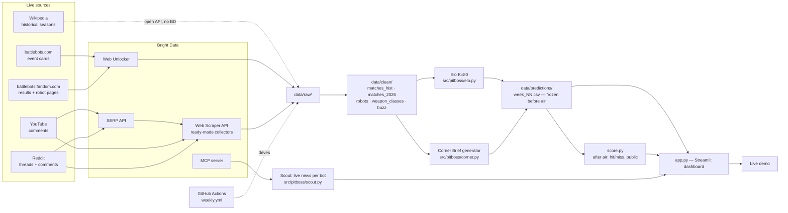

# Pit Boss

**The data corner-man of the BattleBots Pro League.** Before every episode, Pit Boss
briefs both corners of every fight — what the public record says each team should
watch for. It earns the right to talk by grading itself in public: every week its
model's read is frozen in git *before* the episode airs, and scored *after* — hits and
misses, forever.

🔴 **Live demo:** https://battlebots-pit-boss.streamlit.app
📦 **Repo:** https://github.com/Yazan-O/battlebots-pit-boss

Built for #BattleBotsDev. Not betting advice — please don't gamble with it (see
[disclaimer](#not-betting-advice) below).

---

## What it does

Every week, `refresh.py` runs on a schedule (GitHub Actions) and:

1. Scrapes the live BattleBots Pro League season (results + the next fight card) and
   fan buzz (YouTube/Reddit comments) through Bright Data.
2. Scores last week's frozen corner read against what actually happened — publicly,
   including misses.
3. Generates the next episode's **Corner Brief**: for every upcoming fight, a
   data-grounded read for *both* corners — class matchup records, KO profiles,
   career form — built entirely from `data/clean/`, never invented.
4. Commits everything to git. **The commit timestamp is the proof the read existed
   before the episode aired** — nobody can retroactively claim a good call.

The dashboard (`app.py`, Streamlit) reads straight from those committed files, so it's
always exactly as current as the last git push — no separate deploy step, no drift
between what's in the repo and what's on screen.

## Architecture



## How Bright Data is used

Four products, each doing a job nothing else in the stack could do:

| Product | What it fetches | Code | Why this product |
|---|---|---|---|
| **Web Unlocker** | battlebots.com event cards, battlebots.fandom.com results + robot pages | [`brightdata.py:58`](src/pitboss/brightdata.py#L58) (`fetch`), called from [`scrape_season.py:39`](src/pitboss/scrape_season.py#L39), [`scrape_robots.py:62`](src/pitboss/scrape_robots.py#L62) | These pages aren't behind an API; Unlocker gets clean HTML without us building anti-bot handling. |
| **SERP API** | Discovers the right YouTube video + Reddit threads for each episode | [`brightdata.py:94`](src/pitboss/brightdata.py#L94) (`serp`), called from [`scrape_buzz.py:220,248`](src/pitboss/scrape_buzz.py#L220) | We don't know episode video/thread URLs in advance — SERP finds them so the collector step has something to point at. |
| **Web Scraper API** | YouTube + Reddit comments (ready-made collectors, dataset IDs in [`brightdata.py:33-36`](src/pitboss/brightdata.py#L33)) | [`brightdata.py:153`](src/pitboss/brightdata.py#L153) (`collect`), called from [`scrape_buzz.py:68-69,233`](src/pitboss/scrape_buzz.py#L68) | Comment scraping needs a real collector (pagination, rate limits, structured output) — this is the product built for exactly that. |
| **MCP server** | Live scouting search + page reads for the Scout feature | [`brightdata.py:120`](src/pitboss/brightdata.py#L120) (`mcp_call`), called from [`scout.py:31,43`](src/pitboss/scout.py#L31) | The one place we want an agent-style "search, then read what's relevant" loop rather than a fixed URL — MCP is built for that. |

One honest limitation, kept in the code: **Bright Data's own Web Unlocker refuses
Wikipedia** (`robots.txt`, verified — see [`brightdata.py:78`](src/pitboss/brightdata.py#L78)
`fetch_open`). Historical wikitext (used once, to build the training corpus) comes
from Wikipedia's own open API directly. Every *live, current-season* source goes
through Bright Data.

Spend: all four products stay inside their free tiers at our weekly request volume
(~30–60 requests/week). $25 promo credit is untouched buffer, not a dependency.

## The Corner Brief (the product)

Before each episode, every fight gets a brief for **both** corners — what 626 recorded
fights say that corner should watch for. Every line is a computed number, nothing
invented:

> *"Tombstone's finishing threat: 17 of its 21 wins (81%) came by KO — few opponents
> survive to a decision."*
> *"Spinner-vertical has beaten spinner-horizontal in 61% of 142 recorded meetings —
> the class is favored on paper."*

Generated by [`src/pitboss/corner.py`](src/pitboss/corner.py); a bot with fewer than 5
recorded fights gets an explicit "no meaningful record — treat every claim as unknown"
line instead of a false-confidence guess.

## The accountability record

The model (Elo, K=80 — see [Model card](#model-card)) produces a directional read
before each fight. That read is committed to git **before** the episode airs — the
commit timestamp is public, permanent proof it wasn't written after the fact. After
the episode, [`score.py`](src/pitboss/score.py) checks it against what happened and
appends the result to `data/predictions/scorecard.csv`, including every miss, with a
data-grounded "why we missed it" note. Nothing is ever deleted or quietly revised —
`predict.py` refuses to overwrite an already-registered week
([`predict.py`](src/pitboss/predict.py), write-once guard).

**Current public record (episode 102):** 2 of 3 correct.

## Model card

- **Model:** Elo, K=80 (`src/pitboss/elo.py`). Chosen over Bradley-Terry with
  weapon-class features (`bt.py`) and three literature-motivated upgrades (Glicko-2,
  margin-of-victory Elo, cold-start priors — `exp_upgrades.py`) after a pre-committed
  backtest bar (>0.010 log-loss improvement) that none of them cleared. See
  [`notes/MODEL.md`](../notes/MODEL.md) and [`notes/RESEARCH.md`](../notes/RESEARCH.md)
  for the full literature review and honest comparison table.
- **Training data:** 626 historical fights, World Championships I–VII (2015–2023),
  164 bots, scraped from Wikipedia + cross-checked against battlebots.fandom.com.
  Entity resolution (`aliases.csv`) collapses 171 name variants to 153 canonical bots.
- **Backtest protocol:** chronological, no leakage — every evaluated fight uses only
  strictly earlier matches. Tuned on seasons 8–11, held out season 12 (WC VII, n=136),
  touched exactly once.
- **Held-out result:** log-loss **0.6419** vs. coin-flip 0.6931; Brier **0.2260**.
  Calibration plot: [`assets/calibration.png`](assets/calibration.png) — reliability
  curve sits on the diagonal through the 0.35–0.75 probability mass where most fights
  land; extreme bins (n≤4) are noise, not signal.
- **Uncertainty:** leaderboard strength intervals are a parametric bootstrap over the
  real chronological schedule (not i.i.d. row resampling, which breaks path-dependence
  in an online rating system); bots with fewer than 5 fights get an explicit
  population-wide prior band instead of false precision.
- **Known limits:** Elo has no margin-of-victory signal (a decisive KO and a close
  judges' call move the rating the same amount); new-season bots with zero Discovery-
  era history start at the population mean with wide uncertainty by design.

## Signature analyses

- **Weapon meta** ([`assets/weapon_meta.png`](assets/weapon_meta.png)): the vertical-
  spinner "takeover" is **adoption, not dominance** — entry share climbed from 37% to
  53% of the field (WC I→VII) while win rate stayed flat in the 50–62% band.
- **Hype vs. performance** ([`assets/hype_vs_perf.png`](assets/hype_vs_perf.png)):
  fan-comment volume vs. current Elo, with an explicit exposure caveat (bots that
  fought in an aired episode get talked about — this is an attention signal, not a
  quality signal).

Full write-up: [`notes/ANALYSES.md`](../notes/ANALYSES.md).

## Automation

`.github/workflows/weekly.yml` runs on a schedule: Wednesday (pre-register the next
card) and Friday (score the aired episode), plus manual dispatch. It fails closed —
if results for an aired, pre-registered episode can't be found, the run exits nonzero
rather than silently skipping ahead (`score.py`, episode-keyed reconciliation). Every
successful run auto-commits its data changes as `data: auto-refresh <date>`.

## Setup (tested in a fresh venv)

```bash
git clone https://github.com/Yazan-O/battlebots-pit-boss.git
cd battlebots-pit-boss
python -m venv .venv
.venv\Scripts\activate          # Windows; use `source .venv/bin/activate` on macOS/Linux
pip install -r requirements.txt
cp .env.example .env            # then add your own BRIGHTDATA_API_KEY
streamlit run app.py            # dashboard at localhost:8501, reads data/ as-is
```

To regenerate everything from scratch (needs a Bright Data key):

```bash
python -m src.pitboss.refresh    # scrape -> score -> corner briefs -> predict
python -m src.pitboss.elo        # reproduce the backtest numbers above
python -m src.pitboss.calibrate  # reproduce assets/calibration.png
```

## Repo layout

```
src/pitboss/       scrapers, model, registration/scoring, corner briefs, dashboard logic
data/raw/          cached raw scrapes, by source and date (reproducibility trail)
data/clean/        parsed parquet+csv: matches_hist, matches_2026, robots, buzz
data/predictions/  week_NN.csv (frozen before air) + scorecard.csv (public record)
data/corner/       generated corner briefs, per episode
data/quality/      parser-skip audit trail (needs_review.csv)
notes/             MODEL.md, RESEARCH.md, ANALYSES.md, SOURCES.md, BRIGHTDATA.md
app.py             the live dashboard
```

## Not betting advice

BattleBots is pre-taped television — every fight's outcome exists on tape, under NDA,
before it airs. There is no legitimate market for betting on it, and Pit Boss is not
built to create one. This is a public-data engineering project and a methodology
experiment: can an honest, openly-scored model say anything useful about a chaotic
sport, and can that be proven rather than claimed? The Corner Brief is advice to
*builders* — teams — never to bettors. See [LICENSE](LICENSE): commercial or
non-commercial gambling use of this code, data, or its outputs is prohibited.
